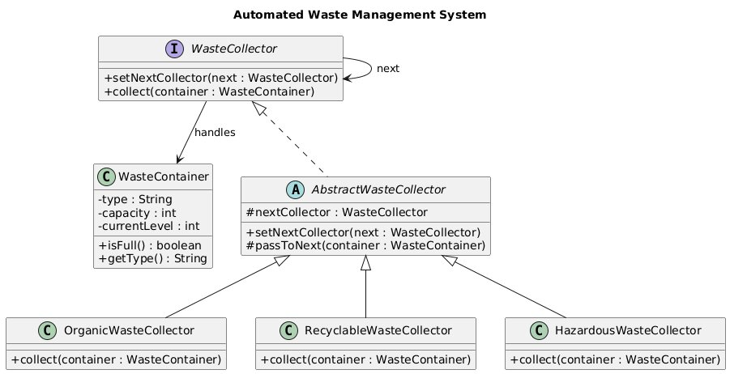

# Automated Waste Management System

## Background
Municipalities and cities face significant challenges in managing and efficiently disposing of waste. Traditional waste collection methods often result in delays, inefficiencies, and high operational costs. An innovative solution is needed to automate the waste management process, ensuring timely collection and disposal while optimizing resource utilization.

## Objective
Develop an **Automated Waste Management System** that uses the **Chain of Responsibility** design pattern to ensure efficient waste collection and disposal.  
The system should handle different types of waste containers and trigger appropriate disposal actions based on the **type** and **capacity** of each container.

## Requirements

### 1. Waste Container
- Create a class to represent waste containers.
- Each container must have:
  - A **capacity**
  - A **waste type** (e.g., organic, recyclable, hazardous)

### 2. Waste Collection Chain
- Implement the **Chain of Responsibility** pattern.
- Each handler in the chain:
  - Is responsible for **one specific type of waste**
  - Decides whether it can handle the container or pass it to the next handler

### 3. Waste Collection Process
- Initialize a chain of waste collectors, each responsible for a different waste type.
- When a waste container:
  - Is **full**, or
  - Requires **disposal**
- The system should trigger the waste collection process.
- The appropriate waste collector in the chain must:
  - Identify the waste type
  - Dispose of the waste correctly based on its capacity

### 4. Validation
- Ensure waste containers are:
  - Correctly identified
  - Handled by the appropriate waste collector
- Verify that no waste container is disposed of by the wrong handler.

## Expected Outcome
- Efficient and automated waste disposal
- Reduced delays and operational costs
- A flexible system that can easily support new waste types by adding new handlers

## UML

